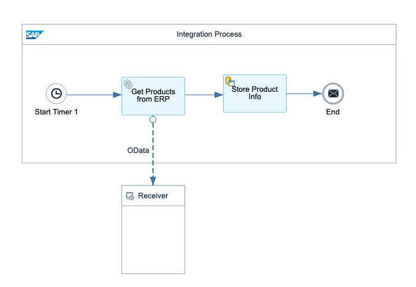
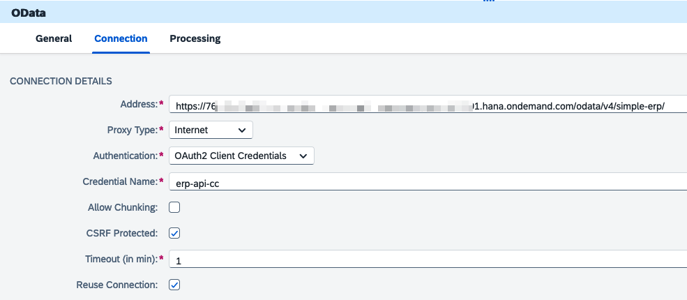
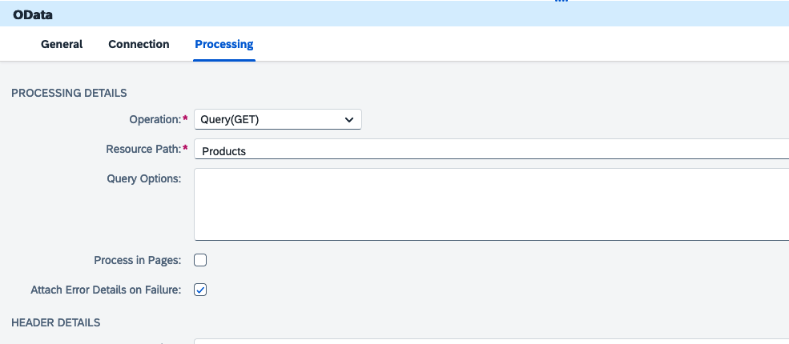
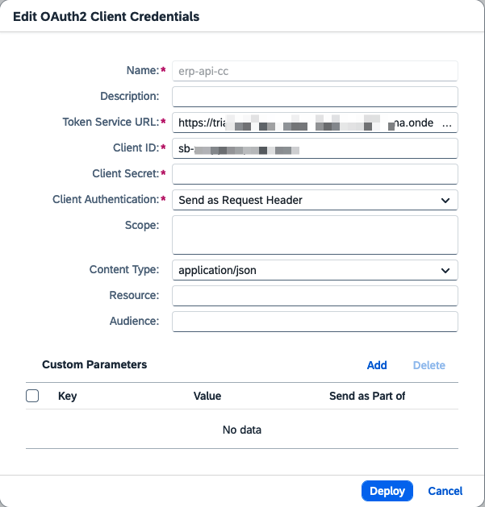

# In- and outbound connection in the SAP integration suite

<!--toc:start-->

- [In- and outbound connection in the SAP integration suite](#in-and-outbound-connection-in-the-sap-integration-suite)
  - [Inbound connection using client credentials](#inbound-connection-using-client-credentials)
    - [Step 1: Model a simple integration flow with http channel](#step-1-model-a-simple-integration-flow-with-http-channel)
    - [Step 2: Deploy the process integration runtime in sap btp](#step-2-deploy-the-process-integration-runtime-in-sap-btp)
    - [Step 3: Invoke the flow using HTTPie or Postman](#step-3-invoke-the-flow-using-httpie-or-postman)
  - [Outbound connection using OAuth 2.0](#outbound-connection-using-oauth-20)
    - [Step 0: Create a Service Key for the `simple-erp-auth-api` XSUAA Instance](#step-0-create-a-service-key-for-the-simple-erp-auth-api-xsuaa-instance)
    - [Step 1: Use HTTPie or Postman to access the API](#step-1-use-httpie-or-postman-to-access-the-api)
    - [Step 2: Create a integration flow](#step-2-create-a-integration-flow)
    - [Step 3: Create Secrets for OAuth](#step-3-create-secrets-for-oauth)
    - [Step 4: Monitor the Integration Flow](#step-4-monitor-the-integration-flow)
  - [Navigation](#navigation)
  <!--toc:end-->

In this lab, we will explore how to perform inbound and outbound connections
using the SAP Integration Suite. Specifically, we will focus on setting up and
configuring both inbound communication with external systems and outbound
connections to services running within the SAP Business Technology Platform
(SAP BTP). By the end of this lab, you will gain practical experience in:

1. Configuring an HTTP inbound channel to receive external requests and
   initiate an integration flow.
2. Authenticating external systems using client credentials to securely access
   the SAP Integration Suite.
3. Setting up outbound connections within an integration flow to invoke
   services hosted on SAP BTP.

For detailed documentation on configuring inbound communication within SAP
Integration Suite, please refer to the following resources:

- [SAP Integration Suite Documentation - Configuring Inbound
  Communication](https://help.sap.com/docs/integration-suite/sap-integration-suite/configuring-inbound-communication)
- [SAP Integration Suite Documentation - Configuring Inbound HTTP
  Connections](https://help.sap.com/docs/integration-suite/sap-integration-suite/configuring-inbound-http-connections)

## Inbound connection using client credentials

### Step 1: Model a simple integration flow with http channel

1. Create a new integration flow with the following elements:

   - Sender: Add an HTTP channel as the sender. Configure it as follows:
     - User Role: Set the user role to `ESBMessaging.send`.
     - Address: Assign an address, such as `/test-inbound-client-credentials`.
     - Uncheck the `CSRF Protected` check box.
   - Start Event: Add a Start event to initiate the flow.
   - Content Modifier: Insert a Content Modifier step in the flow. Use the
     content modifier to add some dummy value to the message header.
   - End Event: Add an End event to complete the integration flow.

2. Deploy the Flow

### Step 2: Deploy the process integration runtime in sap btp

1. Go to your SAP BTP subaccount where the SAP Integration Suite is running.

2. Deploy the Process Integration Runtime

   - Navigate to Instance and Subscription in your subaccount.
   - Create instance of the SAP Process Integration Runtime using the
     `integration-flow` plan.
   - Set the Roles for the instance as `ESBMessaging.send` and the Grant-types
     as `Client Credentials`.  

3. Create a new service key for the Process Integration Runtime using
   `ClientId/Secret` as the key type.

### Step 3: Invoke the flow using HTTPie or Postman

The following description uses HTTPPie to invoke the integration flow.
The approach fpor other tools like Postman mostly similar but differs in certain
steps. For example, the storing of authentication information as environment variables
only makes sense for command line tools. Postman uses a different approach.
for security):

1. Store client credentials as environment variables (optional but recommended).
   In your terminal or environment, set the following variables:

   ```bash
   CLIENT_ID="client_id_of_the_service_key"
   CLIENT_SECRET="client_secret_of_the_service_key"
   ```

2. Invoke the integration flow.

   - Get the endpoint of the flow by navigating to `Monitor` and then the
     `Manage Integration Content`.
   - Also set the log level to `Trace`.
   - Invoke the integration flow using e.g. HTTPie and the command below. Note
     that the example contains some JSON data that is sent to the flow. Again other
     tools like Postman require a different approach for sending JSON data in the request
     body.

     ```bash
     http -a $CLIENT_ID:$CLIENT_SECRET POST \
     "https://<your_integration_flow_url> \
     name=Christian \
     email=drumm@fh-aachen.de
     ```

     This request should trigger the flow, and you can see the processing
     details in message monitor.

## Outbound connection using OAuth 2.0

### Step 0: Create a Service Key for the `simple-erp-auth-api` XSUAA Instance

In order to access the API of the ERP system a service key is needed for the
`simple-erp-auth-api` XSUAA instance.

- Navigate to the Instances and Subscriptions section of your SAP BTP
  subaccount where the ERP system is deployed.
- Select the `simple-erp-auth-api` XSUAA instance.
- Go to the Service Keys area and create a new service key.
- Once the service key is created you can view it to retrieve the `clientid`
  and `clientsecret`, as well as the `url` of the authentication service.

### Step 1: Use HTTPie or Postman to access the API

1. Obtain an Access Token

   - To obtain a token perform a POST request to the `/oauth/token`
     endpoint of the authentication service.
   - the following example shows how to perform this call using HTTPie. This
     example assumes again that the client ID, client secret and the URL are available
     as environment variables (e.g. as `CLIENT_ID`, `CLIENT_SECRET` and `TOKEN_URL`).

   ```bash
   http -a $CLIENT_ID:CLIENT_SECRET POST \
   "$TOKEN_URL/oauth/token?grant_type=client_credentials"
   ```

   - Copy the returend access token and store it in an environment variable
     (e.g. `TOKEN`).

2. Use the obtained token to make a request to the /Products endpoint of the
   ERP system. The following example assumes that the access token is stored in
   an environment variable named `TOKEN` and the URL to access the API in a
   variable named `SRV_URL`.

   The URL of the API can be found by navigating to the cloud foundry space and
   accessing the details of the `simple-erp-srv`.

   ```bash
   http -A bearer -a $TOKEN GET $SRV_URL/odata/v4/simple-erp/Products
   ```

### Step 2: Create a integration flow

Create the integration flow as described in the image below.



To create this flow perform the following steps:

- In the SAP Integration Suite, create a new integration flow.
- Add a Timer start event and configure it to run every 5 minutes.
- Add a Request-Reply step after the Timer start event.
- Connect it to a receiver using the OData adapter. The following images show
  how to configure the OData adapter to use OAuth authentication. In the
  connections tab a credentials with the name `erp-api-cc` are referenced. These
  will be created in the next step.

  

  

- Add a Persist step to store the received data.
- Save and deploy the integration flow.

### Step 3: Create Secrets for OAuth

Navigate to the Monitor section of the integration suite an click on `Security
Material`. Create a new secret with the name `erp-api-cc`.

- The token service URL is the URL of the authentication service followed by `/oauth/token`.
- Fill in the client id and client secret and don't change the other values.
  

### Step 4: Monitor the Integration Flow

Navigate to the Monitoring section of the SAP Integration Suite. Change the log
level of the flow to trace. After a few minutes you should see a successful
execution of the flow.

## Navigation

🏠 [Overview](../README.md) | [< Previous Chapter](./integration-suite.md) | [Next Chapter >](./messaging.md)
