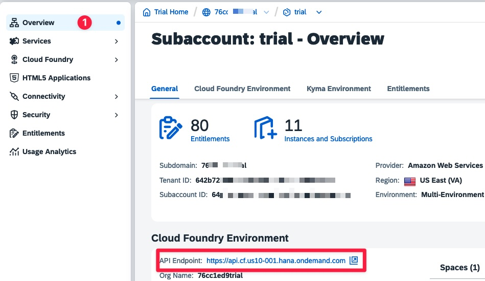

# Running the ERP system

In this lab, you will install and run a small ERP system built using SAP CAP
(Cloud Application Programming). By the end of this exercise, you should have
the system running locally or in SAP Business Technology Platform (BTP), with a
basic understanding of how it operates.

This Mini-ERP system will be used throughout the lecture as a basis for
additional exercises.

## Prerequisites

- A laptop or desktop computer with internet access and

  - a Git client
  - a terminal

- Basic knowledge of the terminal
- Basic knowledge of Git Node.js and SAP BTP

## Running the ERP locally

### Installing the SAP CAP

1. Install Node.js

   - Download and install a current version of [Node.js](https://nodejs.org/)
   - Verify installation:

     ```bash
     node -v
     npm -v
     ```

2. Install SAP CAP Library and tools

   - Open a terminal and install the SAP CAP CLI globally:

     ```bash
     npm install -g @sap/cds-dk
     ```

   - Verify the installation:

     ```bash
     cds -v
     ```

### Clone and run the simple ERP system

1. Clone the Simple ERP System Repository

   - In your terminal, clone the repository from GitHub:

     ```bash
     git clone https://github.com/ceedee666/systems-integration.git
     ```

   - Navigate to the `simple-erp` folder:

     ```bash
     cd systems-integration/src/simple-erp
     ```

2. Install Dependencies

   - Install the project dependencies:

     ```bash
     npm install
     ```

3. Run the Application Locally

   - Start the SAP CAP server locally:

     ```bash
     cds watch
     ```

   - The system should now be running locally. Open a browser and open the URL
     `http://localhost:4004` to access the service. You should see a Web site
     similar to the screenshot below.

     

     The different applications of the ERP system can be accessed using the
     links in the Web application section. To access the application default
     users have been configure in the ERP system. The following users are
     currently defined:

     - User: alice, password: alice, able to access the Web applications
     - User: service-user. password: service-user, able to access the REST api.

## Deploy the system to SAP BTP

The deployment of the Mini-ERP is described using the [SAP Business Application
Studio](https://www.sap.com/products/technology-platform/business-application-studio.html).
It would also be possible to deploy from your computer. However, using the SAP
Business Application Studio is recommended as it simplifies the deployment
process.

### Set Up SAP BTP Trial Account

1. Follow [this
   tutorial](https://developers.sap.com/tutorials/hcp-create-trial-account..html)
   to create a trial account for SAP BTP.

### Set Up SAP Business Application Studio

1. Follow [this
   tutorial](https://developers.sap.com/tutorials/set-up-bas..html) to
   subscribe to the SAP Business Application Studio in your trial account.
2. When creating the development workspace in the 4th step of the tutorial,
   name the development workspace _Systems Integration_.

### Cloning the project and installing dependencies

1. Open the development workspace you created in the previous step.
1. Open the _Source Control_ perspective and click on **Clone Repository**.
   Provide the URL of this repository and clone it into the projects folder
   (`/home/user/projects/`). Select to open the repository.
1. Open a terminal by right-clicking on the `src` folder and selection _Open in
   Integrated Terminal_.
1. Install the required NPM packages. To do this open the `simple-erp`
   subfolder (by executing `cd simple-erp`). In this folder execute `npm
install`.
1. Execute the `npm install` command also in the folder
   `src/simple-erp/app/customers`, `src/simple-erp/app/orders` and
   `src/simple-erp/app/products`.

### Preparing the SAP BTP trial account

The Mini-ERP system is developed in such a way, that it can be deployed to the
SAP BTP. However, some setup is required in a BTP trail account to enable the
deployment. The following steps guide you through the necessary setup.

1. **Adding a SAP HANA Cloud DB instance**

   In a production setting, i.e. When deployed to the SAP BTP, the Mini-ERP
   used the SAP HANA Cloud database. Therefore, an instance of the database is
   required.

   1. To add a SAP HANA Cloud
      DB subscription to the trial account execute the first two steps of [this
      tutorial](https://developers.sap.com/tutorials/hana-cloud-mission-trial-2.html).
   2. Afterwards create a DB instance as described
      [here](https://developers.sap.com/tutorials/hana-cloud-mission-trial-3.html).

   > **Important Note**
   >
   > Make sure to create the DB instance in you Cloud
   > Foundry space as shown in the screenshot below. .

1. Execute the steps 1 to 3 from this
   [tutorial](https://developers.sap.com/tutorials/btp-app-work-zone-subscribe.html)
   to subscribe to the SAP Build Work Zone in your trial account. Steps 4 and 5
   are optional. However, if you execute these steps you will be able to add the
   apps of the Mini-ERP to a launchpad site.

### Packaging and deploying the Mini-ERP system

Finally, your trial account is prepared for the deployment of the Mini-ERP. To
package the app into a deployable archive and deploy it perform the following
steps:

1. Open the workspace you created earlier in the SAP Business Application Studio.
1. Open the `src/simple-erp` folder in an terminal inside your workspace.
1. Package the application by executing the following command:

   ```bash
   mbt build
   ```

   The result of this command should be a new folder named `mta_arcvhive`
   containing one `.mtar` file.

1. Log in to the Cloud Foundry environment in your account using:

   ```bash
   cf login
   ```

   You find the required API endpoint in the overview of your sub-account in
   the BTP cockpit (cf. screenshot below).

   

1. Once you are logged in to the Cloud Foundry environment start the deployment
   by executing:

   ```bash
   cf deploy mta_archives/simple-erp_1.0.0.mtar
   ```

   If the deployment completes successfully, the apps of the Mini-ERP system
   will be available in _HTML5 Applications_ section of the BTP cockpit.

> **Important Note**
>
> In the trial account the services are stopped each night automatically. If
> the deployment fails or you are not able to access the apps make sure the
> following services are running:
>
> - the HANA Cloud DB service. The status of the service can be checked in the
>   HANA Cloud cockpit.
> - The `simple-erp-srv`. The status can be checked in the dev space of the
>   Cloud Foundry environment.
>
> If the HANA Cloud DB service is stopped, the deployment will fail. If the
> `simple-erp-srv` is stopped, the app will not be available.

### Assigning necessary roles

To complete the deployment a role collection needs to be created and assigned
to your user. To do open _Role Collections_ in the _Security_ area of your
sub-account and perform the following steps:

1. Create a new role collection with the name _Simple ERP All_.
1. Add the roles `customerservice` and `system-integration` to the role
   collection. You will find these roles using the application identifier
   _simple-erp_.
1. Assign this role collection to your user.

After performing these steps you should be able to access the apps of the
Mini-ERP system.

## SAP CAP resources

- [SAP CAP documentation](https://cap.cloud.sap/)

### Tutorials

- [Develop a Full-Stack CAP Application Following SAP BTP Developer’s
  Guide](https://developers.sap.com/group.cap-application-full-stack.html)
- [Deploy a Full-Stack CAP Application in SAP BTP, Cloud Foundry Runtime
  Following SAP BTP Developer’s
  Guide](https://developers.sap.com/group.deploy-full-stack-cap-application.html)
- [Build an Application End-to-End Using CAP, Node.js and VS
  Code](https://developers.sap.com/mission.btp-application-cap-e2e.html)
- [Developing an SAP Fiori Elements App Based on a CAP OData V4
  Service](https://learning.sap.com/learning-journeys/developing-an-sap-fiori-elements-app-based-on-a-cap-odata-v4-service)

## Navigation

🏠 [Overview](../README.md) | [Next Chapter >](./file-transfer.md)
