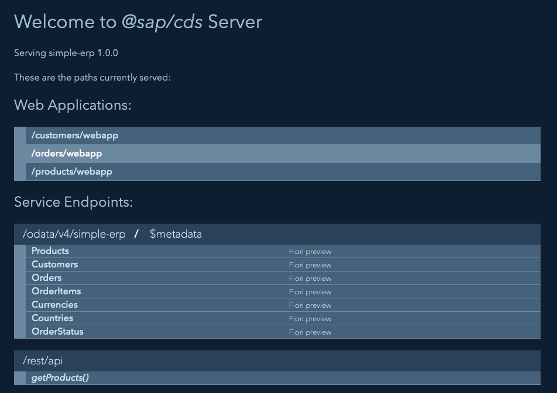

# Running the ERP system

In this lab, you will install and run a small ERP system built using SAP CAP
(Cloud Application Programming). By the end of this exercise, you should have
the system running locally or in SAP Business Technology Platform (BTP), with a
basic understanding of how it operates.

This Mini-ERP system will be used throughout the lecture as a basis for
additional exercises.

## Prerequisites

- A laptop or desktop computer with internet access and

  - a Git client
  - a terminal

- Basic knowledge of the terminal
- Basic knowledge of Git Node.js and SAP BTP

## Running the ERP locally

### Installing the SAP CAP

1. Install Node.js

   - Download and install a current version of [Node.js](https://nodejs.org/)
   - Verify installation:

     ```bash
     node -v
     npm -v
     ```

2. Install SAP CAP Library and tools

   - Open a terminal and install the SAP CAP CLI globally:

     ```bash
     npm install -g @sap/cds-dk
     ```

   - Verify the installation:

     ```bash
     cds -v
     ```

### Clone and run the simple ERP system

1. Clone the Simple ERP System Repository

   - In your terminal, clone the repository from GitHub:

     ```bash
     git clone https://github.com/ceedee666/systems-integration.git
     ```

   - Navigate to the `simple-erp` folder:

     ```bash
     cd systems-integration/src/simple-erp
     ```

2. Install Dependencies

   - Install the project dependencies:

     ```bash
     npm install
     ```

3. Run the Application Locally

   - Start the SAP CAP server locally:

     ```bash
     cds watch
     ```

   - The system should now be running locally. Open a browser and open the URL
     `http://localhost:4004` to access the service. You should see a Web site
     similar to the screenshot below.

     

     The different applications of the ERP system can be accessed using the
     links in the Web application section. To access the application default
     users have been configure in the ERP system. The following users are
     currently defined:

     - User: alice, password: alice, able to access the Web applications
     - User: service-user. password: service-user, able to access the REST api.

## Deploy the system to SAP BTP

### Set Up SAP BTP Trial Account

1. Follow [this
   tutorial](https://developers.sap.com/tutorials/hcp-create-trial-account..html)
   to create a trial account for SAP BTP.

2. Optional: Download and install the [Cloud Foundry Command Line Interface (CF
   CLI)](https://developers.sap.com/tutorials/cp-cf-download-cli.html).

### Installing dependencies

1. Install MBT (Multi-Target Application Build Tool)

   - MBT is used to package and deploy multi-target applications on SAP BTP.
     Install MBT globally:

     ````bash
     npm install -g mbt
     ```bash
     ````

## SAP CAP resources

- [SAP CAP documentation](https://cap.cloud.sap/)

### Tutorials

- [Develop a Full-Stack CAP Application Following SAP BTP Developer’s
  Guide](https://developers.sap.com/group.cap-application-full-stack.html)
- [Deploy a Full-Stack CAP Application in SAP BTP, Cloud Foundry Runtime
  Following SAP BTP Developer’s
  Guide](https://developers.sap.com/group.deploy-full-stack-cap-application.html)
- [Build an Application End-to-End Using CAP, Node.js and VS
  Code](https://developers.sap.com/mission.btp-application-cap-e2e.html)
- [Developing an SAP Fiori Elements App Based on a CAP OData V4
  Service](https://learning.sap.com/learning-journeys/developing-an-sap-fiori-elements-app-based-on-a-cap-odata-v4-service)

## Navigation

🏠 [Overview](../README.md) | [Next Chapter >](./file-transfer.md)
