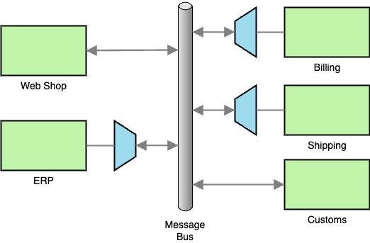
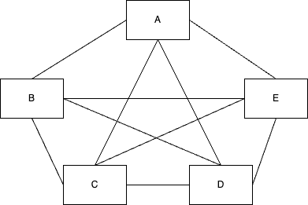

# Enterprise integration patterns in detail

<!--toc:start-->

- [Enterprise integration patterns in detail](#enterprise-integration-patterns-in-detail)
  - [Message channel patterns](#message-channel-patterns)
    - [Point-to-point channel](#point-to-point-channel)
      - [Example of a point-to-point channel](#example-of-a-point-to-point-channel)
      - [Relation to other channel patterns](#relation-to-other-channel-patterns)
      - [RPC communication](#rpc-communication)
    - [Publish-subscribe channel](#publish-subscribe-channel)
      - [Example of a publish-subscribe channel](#example-of-a-publish-subscribe-channel)
      - [Event messages](#event-messages)
      - [MQTT](#mqtt)
    - [Datatype channel](#datatype-channel)
      - [Example of a Data Type Channel](#example-of-a-data-type-channel)
    - [Guaranteed Delivery](#guaranteed-delivery)
    - [Channel Adapter](#channel-adapter)
      - [Channel adapter and application layers](#channel-adapter-and-application-layers)
    - [Message bus](#message-bus)
      - [Example of a Message Bus](#example-of-a-message-bus)
      - [Key Elements of the Message Bus](#key-elements-of-the-message-bus)
  - [Message patterns](#message-patterns)
    - [Command message](#command-message)
      - [Example of a command message](#example-of-a-command-message)
      - [Relation to other patterns](#relation-to-other-patterns)
    - [Document Message](#document-message)
      - [Example of a Document Message](#example-of-a-document-message)
      - [Relation to other patterns](#relation-to-other-patterns)
    - [Event Message](#event-message)
      - [Example of an Event Message](#example-of-an-event-message)
      - [Push vs. pull for event messages](#push-vs-pull-for-event-messages)
        - [Push model](#push-model)
        - [Pull model](#pull-model)
      - [Relation to Other Patterns](#relation-to-other-patterns)
    - [Request-reply](#request-reply)
      - [Example of request-reply](#example-of-request-reply)
      - [Relation to other patterns](#relation-to-other-patterns)
    - [Correlation identifier](#correlation-identifier)
      - [Relation to other patterns](#relation-to-other-patterns)
    - [Message expiration](#message-expiration)
  - [Message routing patterns - Reading Week Task](#message-routing-patterns-reading-week-task)
    - [Task Description](#task-description)
    - [Steps to complete the task](#steps-to-complete-the-task)
  - [Message transformation patterns](#message-transformation-patterns)
    - [Message translator](#message-translator)
      - [Levels of transformation](#levels-of-transformation)
      - [Chaining transformations](#chaining-transformations)
        - [Chaining example](#chaining-example)
      - [Visual mapping tools](#visual-mapping-tools)
    - [Content enricher](#content-enricher)
      - [Example: enriching an order confirmation with delivery details](#example-enriching-an-order-confirmation-with-delivery-details)
    - [Content filter](#content-filter)
      - [Relation to other patterns](#relation-to-other-patterns)
    - [Normalizer](#normalizer)
      - [Example: normalizing sales data from multiple regions](#example-normalizing-sales-data-from-multiple-regions)
      - [The normalizer pattern](#the-normalizer-pattern)
    - [Canonical data model](#canonical-data-model)
      - [The challenge of point-to-point integrations](#the-challenge-of-point-to-point-integrations)
      - [Challenges in creating a canonical data model](#challenges-in-creating-a-canonical-data-model)
      - [Possible approaches for implementing a canonical data model](#possible-approaches-for-implementing-a-canonical-data-model)
  - [Messaging endpoints](#messaging-endpoints)
    - [Messaging gateway](#messaging-gateway)
    - [Transactional client](#transactional-client)
    - [Polling consumer](#polling-consumer)
    - [Event-driven consumer](#event-driven-consumer)
  - [References](#references)
  <!--toc:end-->

The diagram below provides an overview of the different enterprise integration
patterns that are discussed in detail in this lecture. Note that this is only a
selection of the patterns defined in the enterprise integration pattern book.
For a comprehensive list of patterns, see the [^1].


## Message channel patterns

### Point-to-point channel

> **Problem statement**
>
> How can a sender ensure that only one consumer will process a message?

In enterprise integration scenarios, some processes require **exclusive
processing** of messages, where only one consumer should handle each message.
This is crucial in cases where duplicated processing would lead to errors,
inconsistencies, or wasted resources. Without a mechanism to enforce
single-message consumption, multiple consumers could potentially process the
same message, resulting in duplicate actions or data conflicts.

The Point-to-Point Channel pattern addresses this by allowing each message
to be consumed by only one receiver. The messaging system takes care that each
message can only ever be consumed by one receiver.

#### Example of a point-to-point channel

Imagine an order processing system where a Web shop needs to send each order to
an ERP system for fulfillment. Each order must be handled only once by the ERP
system; otherwise, processing it multiple times could result in duplicate
invoices or incorrect inventory reductions.

In this scenario, the Web shop places each order on a Point-to-Point
Channel. The ERP system listens to this channel and consumes messages as they
arrive. Once the ERP system processes an order, the message is removed from the
channel, ensuring no other consumers can access it.


#### Relation to other channel patterns

- Publish-Subscribe Channel: Unlike the Point-to-Point Channel, a
  Publish-Subscribe Channel allows multiple consumers to receive the same
  message. This pattern is used when the goal is to broadcast information to
  multiple systems that each act on the message independently.

- Competing Consumers: In scenarios where a high volume of messages needs to be
  processed efficiently, multiple consumers can be set up to compete for
  messages on the same Point-to-Point Channel. This setup, known as Competing
  Consumers, allows each instance to process a portion of the messages,
  effectively balancing the load across multiple systems without duplicating
  message processing.

#### RPC communication

RPC communication can be implemented using a pair of point-to-point channels.
The requester sends a command message in the request channel and receives a
document message in the response channel.

### Publish-subscribe channel

> **Problem Statement**
>
> How can a sender broadcast a message to multiple consumers so that each
> consumer receives its own copy?

In many integration scenarios, a single message needs to be distributed to
multiple systems or services, each acting independently on the same
information. This is common in event-driven architectures where various systems
need to stay synchronized or updated when an event occurs. Without a mechanism
to distribute copies of the same message to multiple consumers, each recipient
would need to poll or request the message separately, leading to inefficiency
and delays.

The publish-subscribe channel pattern addresses this by broadcasting each
message to all consumers subscribed to the channel. When a message is sent to a
publish-subscribe channel, every subscriber receives its own copy of the
message, allowing each consumer to process the message independently.

#### Example of a publish-subscribe channel


Consider the address change of a customer in a Web shop. Several systems need to
be notified about this update:

- The ERP system to send deliveries and invoices to the right address
- The CRM system to send advertisements to the right address

In this scenario, the Web shop publishes the address update on a
publish-subscribe channel. Each subscribing system receives its own copy of the
address update message. This allows each system to act on the order update in
its own way without interfering with other systems.

#### Event messages

The publish-subscribe channel is a core component of event-driven
communication, where changes in one system (events) are immediately broadcast
to multiple listeners.

#### MQTT

[MQTT](https://mqtt.org/) (Message Queuing Telemetry Transport) is a
lightweight messaging protocol often used to implement publish-subscribe
communication. Originally developed for low-bandwidth, high-latency networks,
MQTT has become a popular choice for IoT (Internet of Things) applications,
mobile devices, and other systems where efficient, reliable, and asynchronous
communication is essential.

### Datatype channel

> **Problem Statement**
>
> How can an application send different data items in such a way that the
> receiver knows how to process them?

In an enterprise system, various types of messages flow through the messaging
infrastructure. Each message type (e.g., orders, stock updates, invoices) may
have a different format and structure. A receiver must know which message
it receives. Otherwise it is not able to process the messages.

This problem could be solved using different approaches:

- Adding a format identifier to the message (cf.
  [EDIFACT](./exchange-formats.md#introduction-to-edifact))
- Using a [Command Message](#command-message) with a specific command for each
  of the message types

The Datatype Channel pattern addresses this issue by organizing channels based
on the type of data they carry. By assigning each message type to its own
channel, the sender knows the type of message based on the channel through
which it is sent.

#### Example of a Data Type Channel

Consider a Web shop that sends different types of messages to an ERP
system:

- Customer address updates
- Request for quotations
- Purchase orders

Using Datatype Channels a separate channel is created for each message type.


### Guaranteed Delivery

> **Problem Statement**
>
> How can a sender ensure that a message is delivered to its intended recipient
> even in the case of network failures or system downtime?

In enterprise integration, some messages are critical and must be reliably
delivered. Temporary network issues or downtime in the receiving system could
result in message loss. Also the messaging system might not temporarily no be
available. All these issues may lead to lost messages and, as a result, to
incomplete transactions, missing updates, or data inconsistencies.
Consequently, a mechanism is required to ensure that the message will reach its
destination, regardless of temporary issues.


The Guaranteed Delivery pattern addresses this problem by adding persistent
data stores to the all involved systems (i.e. sender, messaging system and
receiver). Using the Guaranteed Delivery pattern sending a message involves the
following steps:

1. The sender stores the message in its data store. Sending only completes once
   the message has been stored.
2. The message is forwarded to the messaging system. It is only deleted from
   the data store of the sender once it has been successfully stored in the
   messaging systems data store.
3. The message is forwarded to the receiver. It is only deleted form the data
   store of the messaging system once it has been successfully stored in the
   receiver data store.
4. Finally, the receiver processes the messages and deletes it from the data
   store once it has been successfully processed.

The increased reliability of the guaranteed delivery pattern obviously reduced
the performance of the message delivery and requires additional storage.
Depending on the message size and the duration of an outage huge amounts of
storage might be required. For this reason some messaging systems support retry
timeouts or maximum number of retries. Also the Message Expiration pattern
might be used to limit the amount of time a message is stored.

### Channel Adapter

> **Problem Statement**
>
> How can we integrate applications that were not designed with messaging in
> mind into a messaging infrastructure?

In an enterprise environment, some applications — often legacy systems or
external systems — lack native messaging capabilities. If the existing system
provide an API it most likely will not fit the API of the messaging system.
Nevertheless, these systems need to be connected to the messaging system.

In case of custom applications functionality for the integration with the
messaging system could be added to the application. This would increase the
complexity of the application. Furthermore, this approach closely ties the
application to a particular messaging system.

The Channel Adapter pattern addresses these issue by creating a connection
between the application and the messaging system. The channel adapter acts as a
client to the messaging system. It translates messages and invokes the
appropriate application functionality. It also listens to application events
and send messages via the messaging system in response to these events.

The Channel Adapter pattern aims to adapt the interfaces of the messaging
system and the connected application to each others. In this respect it is
quite similar to the adapter pattern in the Design Patterns book. [^2].

#### Channel adapter and application layers


The channel adapter can connect to different layers of an application:

1. **UI layer**:

   Sometimes it is not possible to expose the functionality of a system via an
   API. The reason could be that an legacy system simply does not provide the
   functionality or a system vendor does not provide the necessary APIs. In
   these cases a UI adapter enable the access to the same functionality a user
   has on the UI of the application. The downside of an adapter on the UI level
   is that these adapters tend to be brittle and comparably slow.

2. **Business logic layer**:

   Information systems usually expose their
   functionality via an API. These API are provided by vendors to support
   system integration. The APIs tend to be more stable the UI of an application.
   Additionally, APIs offer better performance then an integration on the UI
   Layer. If a system offers an API on the business logic layer, it is the
   recommended layer to implement the channel adapter.

3. **Database layer**:

   Most information system persist their data in a relation database. A channel
   adapter on the database layer can extract the data from the database without
   the knowledge of the application. A trigger can be added to the database to
   always send a message when relevant tables change. This approach can be used
   when there is no other programmatic access to the application, or when
   read-only data extraction is sufficient. Updates on the database layer
   usually are very dangerous as they circumvent the business logic of the
   application.

### Message bus

> **Problem Statement**
>
> How can multiple applications send messages to each others while being
> loosely coupled? It should be possible to easily add and remove applications.

In large enterprise systems, applications often need to communicate with each
other, exchanging data and triggering actions across different systems.
However, directly connecting each application to every other application leads
to a tightly coupled architecture that is difficult to scale or maintain. Every
time a new application is added, new point-to-point connections must be
created, increasing complexity.

The message bus pattern provides a solution by introducing a central
communication infrastructure that acts as a common messaging backbone. This bus
enables multiple applications to communicate in a standardized and loosely
coupled manner. Applications are not aware of each other’s internal structures
or implementations; they simply send and receive messages via the bus.

#### Example of a Message Bus

Consider a system landscape where multiple systems handle different parts of the
order process:

- A Web shop handles the creation of customer orders.
- A ERP system reserves raw material for an order an schedules production.
- A customs application handles the customs clearance of the order.
- The billing system generates the invoice and sends it to the customer.
- Finally, a shipping system plans and schedules the shipping of an order

Each of these systems needs to react on activities of other systems (e.g. when
an order is created). To achieve this each system only interacts with the
message bus. This allows changes to the individual application without the
other applications being impacted. For example, if a new billing system is
added, it can simply subscribe to relevant messages.



#### Key Elements of the Message Bus

1. **Common Communication Infrastructure**

   The message bus serves as the backbone for all communication between
   applications. Each application connects to the bus, and messages are routed
   through this central channel. This setup eliminates the need for direct
   connections between applications, reducing complexity. The communication
   infrastructure may include a Message Router or may be based on
   Publish-Subscribe channels.

2. **Adapters**

   Applications typically do not natively support communication over the
   Message Bus. To solve this, each application uses an adapter to interface
   with the bus. This adapter can, for example, be implemented using the
   channel adapter pattern.

3. **Common Command Structure**

   The message bus uses a predefined command structure to ensure all messages
   participants understand the messages. This can be achieved using the command
   massage pattern. Furthermore, the data structure of the transmitted data
   need to be agreed upon by all involved applications. The can be achieved
   using a canonical data model.

## Message patterns

### Command message

> **Problem statement**
>
> How can a request for an action be communicated between systems using messing?

In many enterprise integration scenarios, one system needs another system to
perform a specific action. The requesting system often has limited knowledge of
the processing system, and the goal is to send a command for execution without
tight coupling. This separation ensures that changes in one system do not
directly impact the other.

The Command Message pattern addresses this by encapsulating a request for an
action within a message. The command specifies what action needs to be
performed and often carries the data necessary for the action.

#### Example of a command message

Consider an ERP system that need to trigger the update of currency exchange
rates in some external system. The ERP system could use the follwoing Command
Message to trigger the update:

```json
  "command": "UpdateExchangeRate",
  "data": {
    "currencyFrom": "USD",
    "currencyTo": "EUR",
  }
```


#### Relation to other patterns

- Document message:

  Unlike a command message, a document message carries data or state
  information without specifying an action. It is up to the receiving system to
  determine how to handle the data.

- Request-reply pattern:

  Command messages are often used with the request-reply pattern when a
  response is expected. The requester sends a Command Message and waits for a
  reply indicating the result of the action.

- Point-to-point channel:

  Command messages are usually sent via point-to-point channels. This ensures
  that each command will be invoked only once and by exactly one receiver.

### Document Message

> **Problem Statement**
>
> How can data or state information be transferred from one system to another
> in a way that allows the receiver to process it independently?

The most common problem in distributes systems is that one system has data
another system needs. Different integration styles (file transfer, shared
database or RPC) try to address this problem.

The document message pattern addresses this by encapsulating data or state
information in a message that is sent to another system. The document message
carries the data without specifying a particular action, allowing the receiver
to determine how to process it.

#### Example of a Document Message

Consider a scenario where a Web shop generates a purchase order for products
that need to be processed by an ERP system. The Web shop creates a document
message containing all the details of the purchase order, such as the customer
information, items, and total amount (cf example below). This message is sent
to the ERP system, which then processes it based on its internal logic (e.g.,
updating inventory, generating invoices, scheduling shipment).

```xml
<PurchaseOrder>
    <OrderID>PO-123456</OrderID>
    <OrderDate>2024-11-11</OrderDate>
    <Customer>
        <CustomerID>CUST-7890</CustomerID>
        <Name>Jane Doe</Name>
        <Address>
            <Street>123 Elm Street</Street>
            <City>Springfield</City>
            <State>IL</State>
            <PostalCode>62704</PostalCode>
            <Country>USA</Country>
        </Address>
    </Customer>
    <Items>
        <Item>
            <ProductID>PROD-001</ProductID>
            <ProductName>Wireless Mouse</ProductName>
            <Quantity>2</Quantity>
            <PricePerUnit>25.99</PricePerUnit>
        </Item>
        <Item>
            <ProductID>PROD-002</ProductID>
            <ProductName>Mechanical Keyboard</ProductName>
            <Quantity>1</Quantity>
            <PricePerUnit>79.99</PricePerUnit>
        </Item>
    </Items>
    <TotalAmount>131.97</TotalAmount>
</PurchaseOrder>
```


#### Relation to other patterns

- Event message

  Document and event message are closely related. While a document message
  contains data or state information to be processed by the receiving system,
  an event message signals that something of interest has happened in the
  sender system. The main difference is that usually for an event message the
  timing is more important then the content. In contrast to that the content of
  a document message is more important that the timing.

- Command message

  Unlike a document message, a command message explicitly instructs the
  receiver to perform a specific action. The document message focuses solely on
  data transfer, while the command message specifies what action needs to be
  taken using the provided data.

- Point-to-point channel

  Document Messages are typically transferred via a
  point-to-point channel, ensuring that only one receiver processes the message.
  This exclusive consumption guarantees that the message is handled exactly once,
  which is especially important for critical data like purchase orders or
  customer updates.

- Request-reply pattern
  In a request-reply interaction, the reply to a
  request is often a document message. For example, an ERP system might send a
  command message to a financial service requesting updated exchange rates. The
  response would come back as a document message containing the updated rates,
  providing the necessary data without further instructions.

### Event Message

> **Problem Statement**
>
> How can changes or state transitions in one system be communicated to other
> systems in a way that triggers appropriate responses?

In distributes systems one systems often need to notify others of changes or
significant state transitions (events). For example, a central pricing system
might notify the ERP system and the Web shop about price changes of products.
Implementing this notification using RPC would require each receiver to
immediately react on the event. Furthermore, the sender would need to know all
receivers.

The event message pattern addresses this by encapsulating an event within a
message and broadcasting it to other systems. The receiving systems subscribe
to (e.g. via the publish-subscribe channel pattern) and react to the event as
needed.

#### Example of an Event Message

When a shipping systems ships an order, it creates an event message to notify
other systems of the status change of the order. The event might indicate that
the order is "Shipped."

The ERP system subscribes to this event to update the state of the order, while
the notification service sends a confirmation email.


#### Push vs. pull for event messages

##### Push model

In the push model, when an event occurs, the event message itself carries all
the necessary data required by the consumers. This means that the producer
includes the complete new state with the event. Consumers receive the new state
immediately without further requests.

In this model the event message is a combined event and document message.

##### Pull model

In the pull model, when an event occurs, the event message contains minimal
information, often just a notification or identifier indicating that an event
has happened. Interested consumers must then retrieve additional data
themselves if they wish to act on the event. This model keeps the initial event
lightweight but requires follow-up interactions. The pull model requires three messages:

1. An _update_ that notifies receivers of the event. This is an event message.
2. A _state request_, a command message, interested receivers use to request
   additional details.
3. A _state reply_, a document message send to the receiver, containing the
   additional details.

Both approaches have advantaged and disadvantages. In the push model the main
advantage is that initial event messages are small. The disadvantage is the
additional channels and messages needed for the state request and state reply.

#### Relation to Other Patterns

- Publish-Subscribe Channel

  Event Messages are commonly used with Publish-Subscribe Channels to broadcast
  events to multiple systems.

### Request-reply

> Problem statement
>
> How can two systems communicate when the requester needs a response to its
> request? How does the receiver know where to send a reply?

In many enterprise integration scenarios, one system must send a request to
another system and wait for a response. This is a common pattern for tasks like
querying a database, validating a transaction, or retrieving data from a
service. The request-reply pattern addresses this by using two messages:
one for the request and another for the reply.

A key feature of this pattern is the inclusion of the reply channel address in
the message header. This informs the receiving system where to send the reply.
Using this approach keeps the systems loosely coupled as the reply information
address is only read from the message and not hard coded or configured in
advance.


The request-reply pattern typically consists of the following steps:

1. The requester sends a command message to a point-to-point channel, including
   the address of the reply channel in the message header.
2. The receiver processes the message and sends a document message containing
   the result to the specified reply channel.
3. The requester uses the reply channel to receive the response. Optionally,
   the receiver is correlating the response to the original request using a
   correlation identifier.

#### Example of request-reply

An ERP system queries a financial service for the latest currency exchange rates.

1. Request message (sent by the ERP system):

   ```json
   {
     "command": "GetExchangeRate",
     "data": {
       "currencyFrom": "USD",
       "currencyTo": "EUR"
     },
     "headers": {
       "replyChannel": "currency-exchange-reply-queue-erp",
       "correlationId": "REQ-12345"
     }
   }
   ```

2. Reply message (sent by the financial service to the specified reply channel):

   ```json
   {
     "data": {
       "currencyFrom": "USD",
       "currencyTo": "EUR",
       "exchangeRate": 0.93
     },
     "headers": {
       "correlationId": "REQ-12345"
     }
   }
   ```

#### Relation to other patterns

- Command message:

  The request in the request-reply pattern is typically encapsulated as a
  command message.

- Document message:

  The reply is usually a document message containing the requested data or
  operation result.

- Correlation identifier:

  The correlation identifier in the request and reply headers ties the response
  to the corresponding request.

- Point-to-point channel:

  Both the request and reply messages are sent via point-to-point channels to
  ensure exclusive consumption.

### Correlation identifier

> Problem statement
>
> How can a requester match a response to in a channel to a specific request?

In distributed systems, multiple requests may be in progress simultaneously,
and each response must be matched to its corresponding request. The
correlation identifier solves this problem by assigning a unique identifier
to each request, which is included in both the request and response messages.


Communication using a correlation identifier usually consists of the following steps:

1. Assign a unique identifier:

   The requester generates a unique correlation identifier and includes it in
   the request message.

2. Include the same identifier in the response:

   The receiver processes the request and includes the same correlation
   identifier in the response message.

3. Match the response to the request:

   The requester uses the correlation identifier to associate the response with
   the original request.

The correlation identifier is often implemented using a message header field.
Furthermore, a message might use separate message and correlation identifiers
to allow message chaining.

#### Relation to other patterns

- Request-reply:

  The correlation identifier is essential for matching replies with their
  corresponding requests in the request-reply pattern.

- Point-to-point channel:

  Responses are usually sent via point-to-point channels, ensuring exclusive
  delivery of the message to the intended recipient.

By including a **correlation identifier**, distributed systems can handle
concurrent requests and responses reliably, ensuring that each response is
processed in the correct context.

### Message expiration

> Problem statement
>
> How can a sender indicate that message that a message should not be processed
> after a certain period or date?

In distributed systems, some messages have a limited period of relevance. For
instance, time-sensitive data like stock prices, flight availability, or
temporary discounts may lose their value after a certain point. Processing
outdated messages can lead to incorrect decisions or wasted resources. The
message expiration pattern ensures that such messages are discarded when they
are no longer useful. Furthermore, in a messaging system there is no way the
sender can cancel a request once it is send. The message expiration pattern
solve this problem by assigning an expiration time to the message.


In the message expiration pattern, the sender assigns an expiration timestamp
or duration to the message, indicating how long the message remains valid. If
the message is not delivered or consumed within the expiration time the
messaging system might either discards the message or sends it to a dead
message channel.

## Message routing patterns - Reading Week Task

### Task Description

Each group of students will focus on a selected Message Routing Pattern. The
goal is to develop a deep understanding of the assigned pattern, including its
purpose, mechanics, and use cases within enterprise integration scenarios.

### Steps to complete the task

- Read about the selected pattern

  Each group is expected to thoroughly read and
  understand their assigned pattern, exploring its role, structure, and
  application in message routing.

- Create a presentation and example implementation

  Based on your understanding, create a presentation that explains the selected
  pattern in detail, supported by an example implementation demonstrating how
  the pattern works in practice.

- Present during the next lecture

  During the next lecture, each group will present their findings and
  implementation to the class, sharing insights, challenges, and practical
  applications of the pattern.

## Message transformation patterns

In enterprise integration, data often needs to be transformed as it moves
between systems to accommodate differences in data formats, structures, or
semantic requirements. This section discusses key message transformation
patterns, including the message translator, content filter, content
enricher, and normalizer, which address common challenges in ensuring
seamless communication between systems.

### Message translator

The message translator pattern was briefly introduced in the [overview of
enterprise integration patterns](/lectures/enterprise-integration-patterns.md)
as a key mechanism for transforming messages to enable communication between
systems. In this section, we will explore the
message translator in greater depth.

> **Problem statement**
>
> How can systems with incompatible data formats or structures communicate with
> each other?

In enterprise integration scenarios, it is common for systems to use different
data formats, structures, or protocols. For example, one system may use XML
while another uses JSON, or a system may expect fields that do not exist in the
source message. Without a way to reconcile these differences, communication
between systems becomes impossible, leading to silos and inefficiencies.

The message translator pattern addresses this problem by transforming messages
into a format or structure that the receiving system can understand. By
adapting the message to meet the requirements of the target system, the message
translator ensures seamless communication between heterogeneous systems without
requiring changes to their internal logic.

#### Levels of transformation

The message translator addresses incompatibilities between systems at various
levels of transformation. These levels ensure that messages can be seamlessly
exchanged despite differences in communication protocols, data formats, or
internal structures. The four levels of transformation are transport, data
representation, data types, and data structure.

1. Transport level

   At the transport level, transformations ensure compatibility between
   different communication protocols used by the sender and receiver. This
   includes adapting messages to work with protocols like HTTP, FTP, or SOAP.
   Adaptation on the transport level is handled by channel adapters.

2. Data representation level

   Data representation transformations address differences in formats,
   encoding, or compression. The focus is on adapting the way data is
   represented without changing its underlying meaning.

   - Example: Format transformation - A Web shop sends order data as JSON, but
     the ERP system requires it in XML.

     - Input (JSON):

       ```json
       {
         "orderId": "12345",
         "customer": "Jane Doe",
         "total": 150.0
       }
       ```

     - Output (XML):

       ```xml
        <Order>
            <OrderID>12345</OrderID>
            <Customer>Jane Doe</Customer>
            <Total>150.00</Total>
        </Order>
       ```

   - Example: Compression

     A sensor sends telemetry data in a compressed binary format, but the
     target analytics system requires the data in plain text.

     - Input: Compressed binary data stream.
     - Output: Plain text or JSON representation of the telemetry data.

3. Data types

   At the data types level, transformations ensure compatibility between the
   individual fields in a message. This includes adapting field names,
   converting data types, or mapping code values between systems.

   - Example: Field name transformation
     A Web shop sends an order field named
     `orderId`, but the ERP system expects `OrderID`. Furthermore, the Web shop uses
     seperate fields for the customer name, while the ERP system uses just one name
     filed.

     - Input:

       ```json
       {
         "orderId": "12345",
         "name": "Jane",
         "surname": "Doe",
         "total": 150.0
       }
       ```

     - Output:

       ```json
       {
         "OrderID": "12345",
         "CustomerName": "Jane Doe",
         "TotalAmount": 150.0
       }
       ```

   - Example: Code value mapping

     A source system uses numeric codes for order
     status (e.g., `1 = Pending`, `2 = Shipped`), while the target system expects
     textual status values (e.g., `"Pending"`, `"Shipped"`).

     - Input: `{ "status": 1 }`
     - Output: `{ "status": "Pending" }`

4. Data structure

   Data structure transformations address differences in how entities and their
   relationships are modeled between systems. This level involves adapting the
   message content to reflect structural changes, such as whether an entity can
   have multiple instances of a related entity.

   - Example:

     A Web shop sends a customer record with a single address, but the target
     CRM system supports multiple addresses per customer.

     - Input (Web shop):

       ```json
       {
         "customerId": "CUST123",
         "name": "Jane Doe",
         "address": {
           "street": "123 Elm Street",
           "city": "Springfield"
         }
       }
       ```

     - Output (CRM system):

       ```json
       {
         "customerId": "CUST123",
         "name": "Jane Doe",
         "addresses": [
           {
             "type": "Home",
             "street": "123 Elm Street",
             "city": "Springfield"
           }
         ]
       }
       ```

#### Chaining transformations

In complex integration scenarios, a single transformation is often insufficient
to meet the requirements of both the sender and receiver. In such cases,
transformations are applied in sequence, or _chained_ to incrementally adapt
the message. Each transformation addresses a specific aspect of compatibility,
ensuring the message evolves step-by-step to match the target system’s
expectations.

Chaining transformations allows modularity, where each step in the chain
handles a distinct transformation task. This approach simplifies maintenance,
improves reusability, and reduces complexity by breaking down large
transformations into smaller, manageable steps.

The major benefits of chaining transformations are:

1. Modularity: Each step in the chain handles a single transformation, making
   the process easier to understand and maintain.
2. Reusability: Individual transformations can be reused in other scenarios
   with similar requirements.
3. Flexibility: Complex transformations can be built by combining simple ones,
   reducing the need for monolithic transformation logic.
4. Error isolation: Debugging becomes easier as each step in the chain can be
   tested independently.

##### Chaining example

A Web shop sends a purchase order to an ERP system. The Web shop uses a JSON
format with alpha-2 country codes and a flat structure. The ERP system requires
XML, ISO 3166-1 alpha-3 country codes, and a hierarchical structure for the
order.

- Input (Web shop JSON message)

  ```json
  {
    "orderId": "PO-12345",
    "customer": {
      "name": "Jane Doe",
      "country": "US"
    },
    "items": [
      { "productId": "PROD001", "quantity": 2, "price": "19.99" },
      { "productId": "PROD002", "quantity": 1, "price": "49.99" }
    ]
  }
  ```

- Chained transformations

  1. Data representation transformation

     Convert the message from JSON to XML.

     ```xml
     <Order>
         <OrderID>PO-12345</OrderID>
         <Customer>
             <Name>Jane Doe</Name>
             <Country>US</Country>
         </Customer>
         <Items>
             <Item>
                 <ProductID>PROD001</ProductID>
                 <Quantity>2</Quantity>
                 <Price>19.99</Price>
             </Item>
             <Item>
                 <ProductID>PROD002</ProductID>
                 <Quantity>1</Quantity>
                 <Price>49.99</Price>
             </Item>
         </Items>
     </Order>
     ```

  2. Code value mapping

     Map the ISO-3166 alpha-2 country code (`US`) to the numeric country code (`840`).

     ```xml
     <Order>
         <OrderID>PO-12345</OrderID>
         <Customer>
             <Name>Jane Doe</Name>
             <Country>840</Country>
         </Customer>
         <Items>
             <Item>
                 <ProductID>PROD001</ProductID>
                 <Quantity>2</Quantity>
                 <Price>19.99</Price>
             </Item>
             <Item>
                 <ProductID>PROD002</ProductID>
                 <Quantity>1</Quantity>
                 <Price>49.99</Price>
             </Item>
         </Items>
     </Order>
     ```

  3. Data structure transformation

     Transform the structure to make the message hierarchical, reflecting the
     ERP system’s entity model.

     ```xml
     <Order>
         <OrderID>PO-12345</OrderID>
         <Customer>
             <Name>Jane Doe</Name>
             <Addresses>
                 <Address type="billing">
                     <Country>USA</Country>
                 </Address>
             </Addresses>
         </Customer>
         <Items>
             <Item>
                 <Product>
                     <ID>PROD001</ID>
                 </Product>
                 <Quantity>2</Quantity>
                 <Price>19.99</Price>
             </Item>
             <Item>
                 <Product>
                     <ID>PROD002</ID>
                 </Product>
                 <Quantity>1</Quantity>
                 <Price>49.99</Price>
             </Item>
         </Items>
     </Order>
     ```

#### Visual mapping tools

Many integration platforms provide visual mapping tools as low-code solutions
to simplify message transformations. These tools enable users to graphically
define mappings, apply transformation rules, and chain multiple transformations
without extensive coding. For example, the SAP Integration Suite offers a
drag-and-drop interfaces to accelerate the development of integrations.


### Content enricher

> **Problem statement**
>
> How can a additional data that is not available in the originating system be
> added to a message to enable proper processing by the receiving system?

#### Example: enriching an order confirmation with delivery details

Consider a Web shop that sends order confirmation messages to customers after
they place an order via a notification system. The Web shop's system generates
a message containing the order details, such as the order ID, purchased items,
and total amount. However, the expected delivery time is not included in the
message because it must be calculated by an external logistics system based on
factors such as the shipping method, destination, and current warehouse stock
levels.


The content enricher pattern is similar to the message translator pattern, with
one key difference: while the translator focuses on transforming the format or
structure of data that is already present in the message, the content enricher
addresses situations where the message itself lacks some of the required
information. This missing information is retrieved from external systems or
resources and added to the message to ensure that the receiving system can
process it effectively.


The content enricher performs the following steps:

1. It uses information from the incoming message to retrieve the missing data
   from an external resource. Possible sources for the missing data are:
   - Computation by the content enricher (e.g. calculating a IBAN from a
     account number and a BIC)
   - Environment (e.g. get the current time stamp from the system)
   - Other system
2. It appends the retrieved data to the message. The data from the incoming
   message might be carried over or discarded.

A common use case for the content enricher is to resolve references. Instead of
sending complex object in a messages only a reference to the object is added to
the message. The content enricher is then used to retrieve the necessary
information form the system containing the objects' details.

### Content filter

> **Problem statement**
>
> How can unnecessary or sensitive data be removed from a message before it is
> sent to the receiving system, ensuring the message contains only the relevant
> information?

In enterprise integration scenarios, messages often include additional data
that may not be relevant for all consumers. This can lead to inefficiencies,
increased processing times, or even data leaks when sensitive information is
exposed to systems that do not need it. The content filter pattern solves this
problem by removing irrelevant or sensitive data from the message, leaving only
the required content for the receiving system. This also helps to keep visual
mapping tools usable. This tools work well for smaller message but become
difficult to work with for lager messages.


Furthermore, content filters not necessarily remove the data but can
be used to flatten complex message structures into simpler ones.

#### Relation to other patterns

Multiple content filters can be used to implement a static splitter.


### Normalizer

> **Problem statement**
>
> How can messages from different sources with varying formats or structures be
> standardized to enable consistent processing by the receiving system?

In enterprise integration scenarios, systems often receive messages from
multiple sources, each using its own unique format, structure, or conventions.
Without a consistent format, the receiving system would need to implement
custom handling logic for each source, increasing complexity and reducing
maintainability. The normalizer pattern solves this problem by transforming
messages into a standardized format, ensuring that the receiving system can
process them uniformly.

#### Example: normalizing sales data from multiple regions

Consider a multinational company with sales data coming from regional offices
in different formats. For instance:

- The European office sends sales data in XML with amounts in euros.
- The North American office uses JSON with amounts in US dollars.
- The Asian office sends CSV files with amounts in local currencies.

To generate consolidated reports, the central analytics system requires all
sales data to be in JSON format with amounts normalized to a common currency
(e.g., euros).

- European office (XML):

  ```xml
  <Sale>
      <Region>Europe</Region>
      <Amount currency="EUR">1000</Amount>
      <Date>2024-11-30</Date>
  </Sale>
  ```

- North American office (JSON):

  ```json
  {
    "region": "North America",
    "amount": {
      "currency": "USD",
      "value": 1200
    },
    "date": "2024-11-30"
  }
  ```

- Asian office (CSV):

  ```csv
  Region,Amount (Local),Currency,Date
  Asia,150000,JPY,2024-11-30
  ```

The normalizer transforms these varied formats into a common JSON format with
amounts converted to euros:

**Normalized message:**

```json
{
  "region": "Europe",
  "amount": 1000,
  "currency": "EUR",
  "date": "2024-11-30"
}
```

#### The normalizer pattern

The normalizer uses a message router together with several message translators to
convert the incoming messages from different sources into a common format.


As this is a common pattern in integration scenarios there is also a special icon
for the normalizer.


### Canonical data model

In enterprise integration scenarios, organizations often rely on multiple
systems that must exchange data. Each system may use its own format, structure,
or semantics, leading to a rapidly growing complexity of transformations
required for communication. This complexity can be visualized as a fully
connected graph, where each system is a node, and each edge represents a
transformation between two systems.

#### The challenge of point-to-point integrations

In a fully connected graph with $n$ nodes (systems), the number of edges
(transformations) grows quadratically according to the formula:

```math
$$
E = \frac{n(n-1)}{2}
$$
```

This formula highlights how the number of transformations escalates as new
systems are added:

- For $n=3$ systems, $E=\frac{3(3-1)}{2}=3$ transformations.
- For $n=4$ systems, $E=\frac{4(4-1)}{2}=6$ transformations.
- For $n=5$ systems, $E=\frac{5(5-1)}{2}=10$ transformations.
- For $n=10$ systems, $E =\frac{10(10-1)}{2}=45$ transformations.

As the number of systems increases, the integration complexity grows
quadratically, making the landscape increasingly difficult to manage. Each
system added requires new transformations to and from every other system,
compounding the development and maintenance effort.



A canonical data model addresses this challenge by acting as a common language
for all systems. Instead of creating direct transformations between every pair
of systems, each system only transforms its data into and out of the canonical
format. This approach reduces the number of required transformations. While
there is still a linear increase in transformations as systems are added, the
complexity is far lower compared to a fully connected graph.

#### Challenges in creating a canonical data model

Despite its advantages, establishing a canonical data model is often a complex
and resource-intensive process. Many organizations struggle to create an common
data model. Most large companies have at least one failed attempt at creating
one. Some of the common challenges for a canonical data model are:

1. High initial investment

   Developing a canonical data model requires significant time and effort.
   Stakeholders must agree on common definitions for all data entities, which
   can involve extensive collaboration across departments and systems.

2. Complexity of system landscape

   Enterprises often have diverse legacy systems with complex data structures.
   Adapting these systems to fit a canonical model can be costly and
   technically challenging.

3. Evolving business requirements

   Enterprises operate in dynamic environments where requirements can change
   rapidly. A canonical data model designed today may become outdated as new
   systems are introduced or business pprocesses evolve, requiring continuous
   updates.

4. Diverse interpretations of data (bounded contexts)

   One of the most significant challenges in creating a canonical data model is
   defining a common language that works across all systems and business
   processes. Data entities, such as "customer," "order," or "product," are
   often interpreted differently by various departments or systems. For example:

   - In sales, a "customer" might include personal details like name, email,
     and purchase history.
   - In logistics, a "customer" might focus on delivery information like
     addresses and contact numbers.
   - In finance, a "customer" might represent an invoicing entity with tax
     identifiers and payment terms.

   This issue becomes apparent when analysing the complex data models of large
   ERP systems. Attempting to enforce a single universal definition for such
   entities can lead to overly complex models that fail to meet the specific
   needs of any department. This issue is exacerbated in large organizations
   with varied processes and regional differences.

#### Possible approaches for implementing a canonical data model

Successfully implementing a canonical data model requires addressing its
inherent challenges with practical and flexible strategies. Instead of
attempting a comprehensive solution from the outset, organizations can adopt
incremental and targeted approaches to mitigate complexity and improve the
chances of success. Below are some possible approaches:

1. Start small

   One of the most effective ways to manage the complexity of a canonical data
   model is to start small and expand incrementally:

   - Focus on high-priority entities: Begin with a limited scope by modeling only
     the most critical or frequently exchanged data entities (e.g., "customer,"
     "order," or "invoice").
   - Incremental development: Extend the model over time as new needs arise,
     rather than attempting to define all entities and relationships at once.
   - Early wins: Demonstrating success in a smaller scope builds confidence and
     buy-in from stakeholders, creating momentum for further adoption.

2. Just a data model for the exchanged data

   Rather than modeling all data entities comprehensively across all systems,
   focus the CDM specifically on the data exchanged between systems. This
   simplifies implementation and avoids unnecessary complexity:

   - Interface-focused design: Define the canonical format only for the data
     fields that need to be exchanged, leaving internal system representations
     untouched.
   - Flexibility: By limiting the scope to exchanged data, organizations can adapt
     more easily to evolving requirements without overhauling internal systems.

3. Leverage bounded contexts

   To address the challenge of reconciling diverse interpretations of data
   entities, organizations can apply the concept of bounded contexts from
   Domain-Driven Design. This approach allows different systems or departments to
   define entities according to their specific needs while maintaining an
   overarching structure:

   - Context-specific definitions: Each system or process defines its own
     representation of an entity (e.g., "customer" in sales vs. "customer" in
     logistics).
   - Linking contexts: Use mappings or transformations to translate between
     representations in different contexts, ensuring consistency across the
     organization.
   - Adaptability: Bounded contexts make it easier to accommodate differences in
     terminology, attributes, and requirements without forcing a universal
     definition.

## Messaging endpoints

Messaging endpoints are the connection points where applications interact with
a messaging system to send or receive messages. They play a crucial role in
enterprise integration by enabling applications to communicate asynchronously
and reliably, even in distributed environments. This section discusses four key
messaging endpoint patterns: messaging gateway, transactional client,
polling consumer, and event-driven consumer. Each pattern is introduced
with a problem statement and explained in detail.

### Messaging gateway

> **Problem statement**
>
> How can an application interact with a messaging system without being tightly
> coupled to its implementation?

Directly integrating an application with a messaging system can lead to tight
coupling, making the application dependent on the specific API of the messaging
infrastructure. This increases complexity and reduces
flexibility, especially when migrating to a new messaging system or supporting
multiple protocols.


A messaging gateway serves as an abstraction layer between the application and
the messaging system. It provides a simplified interface for sending and
receiving messages, hiding the underlying complexity of the messaging
infrastructure. Key benefits:

- Decouples the application from the messaging system.
- Exposes business functionality to the application

Messaging gateways often send messages to other systems and expect a reply (cf.
request-reply pattern). Such a messaging gateway can be implemented as a
synchronous or an asynchronous messaging gateway.

### Transactional client

> **Problem statement**
>
> How can an application ensure reliable message delivery and processing while
> maintaining consistency across multiple operations in a larger transactional
> context?

Messaging systems are inherently transactional to guarantee the reliable
delivery and processing of messages. For example:

- In a publish-subscribe channel, the messaging system needs to ensure that all
  subscribers receive a message.
- In a point-to-point channel, the messaging system needs to ensure that a
  message is delivered to exactly one consumer.

While these guarantees are sufficient for simple message delivery scenarios,
there are use cases where clients require broader transactional context.
Examples for such use cases are:

1. Database updates triggered by messages

   When a message arrives via a channel adapter, the application may need to
   update a database with information from the message. If the database update
   fails, the message must not be marked as processed to ensure it can be
   retried later.

2. Coordination of messages with workflows

   In complex workflows, multiple messages may need to be coordinated to
   complete a single task. The transactional client ensures that messages are
   processed or sent as part of the workflow without leaving the system in an
   inconsistent state.

3. Message-driven orchestration

   Applications that orchestrate actions across multiple systems based on
   incoming messages may require transactional consistency to ensure that
   partially processed workflows can be rolled back.


A transactional client extends the messaging system’s transactional guarantees
by integrating messaging operations into the application’s transactional
boundaries. This allows messaging actions (e.g., sending, receiving) to
participate in distributed transactions alongside other operations like
database updates or external service calls. The transactional client ensures
atomicity across all operations in the transaction:

1. Begin transaction

   The application (transactional sender) or the messaging
   system (transactional receiver) start a transactional context.

2. Perform operations

   - Receive or send messages through the messaging system.
   - Perform related operations such as database updates or service calls.

3. Commit or rollback

   - If all operations succeed, the transaction is committed, ensuring changes
     are permanent, and messages are acknowledged (transactional receiver) or
     sent (transactional sender).
   - If any operation fails, the transaction is rolled back, and all changes
     are reverted. Messages are not send or are not acknowledged

### Polling consumer

> **Problem statement**
>
> How can the application controls when and how often it processes messages?

In many enterprise scenarios, applications do not need to react to messages
immediately as they arrive. Instead, they may process messages in batches,
during specific time windows, or based on their own operational schedule.
Without a mechanism for controlled retrieval, the application might remain idle
while continuously listening for messages, wasting resources.

A polling consumer retrieves messages by periodically checking (polling) a
queue or topic for new messages. This pattern gives the application full
control over when and how often it processes messages, making it ideal for
scenarios where immediate processing is unnecessary or resource availability
varies over time.


### Event-driven consumer

> **Problem statement**
>
> How can an application process messages as soon as they become available to
> enable real-time responsiveness?

The main drawback of a polling consumer is that it repeatedly queries the
messaging system for new messages, even when there are none to process. This
continuous polling consumes unnecessary resources and introduces
inefficiencies, especially in systems with infrequent message arrivals.

A better approach is for the messaging system to notify the application when a
message becomes available. This is the essence of the event-driven consumer.
The messaging system invokes the event-driven consumer whenever a message
arrived. The event driven consumer uses an application specific API to process the message.


🏠 [Overview](../README.md) | [< Previous
Chapter](./enterprise-integration-patterns.md) | [Next Chapter >
](./reliability-performance.md)

## References

[^1]:
    G. Hohpe and B. Woolf, Enterprise integration patterns: designing,
    building, and deploying messaging solutions. The
    Addison-Wesley signature series. Boston Munich: Addison-Wesley, 2013.

[^2]:
    E. Gamma, Ed., Design patterns: elements of reusable object-oriented
    software, 39. printing. in Addison-Wesley professional computing series.
    Boston, Mass. Munich: Addison-Wesley, 2011.
