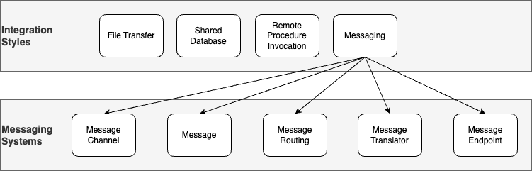
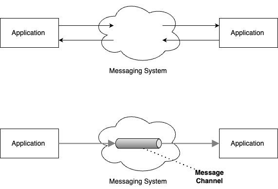
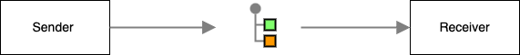
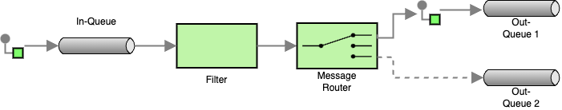
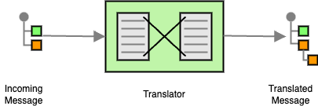
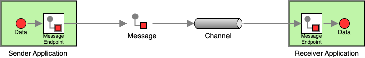

# Introduction to enterprise integration patterns

<!--toc:start-->

- [Introduction to enterprise integration patterns](#introduction-to-enterprise-integration-patterns)
  - [Why Patterns?](#why-patterns)
    - [Exercise: Reflecting on Lab 3 - Synchronizing Product Stock and Purchase Orders](#exercise-reflecting-on-lab-3-synchronizing-product-stock-and-purchase-orders)
      - [Discussion Points](#discussion-points)
  - [The Need for Patterns: A Historical Perspective](#the-need-for-patterns-a-historical-perspective)
    - [Origins of Patterns](#origins-of-patterns)
    - [Patterns in Software Development](#patterns-in-software-development)
    - [Enterprise Integration Patterns (EIP)](#enterprise-integration-patterns-eip)
    - [Why Patterns Matter](#why-patterns-matter)
  - [Organizing Enterprise Integration Patterns](#organizing-enterprise-integration-patterns)
    - [Core Elements](#core-elements)
    - [Message Channel](#message-channel)
    - [Message](#message)
    - [Message Routing](#message-routing)
      - [Pipes-and-Filters](#pipes-and-filters)
      - [Message Routing](#message-routing)
    - [Message Translator](#message-translator)
    - [Message Endpoints](#message-endpoints)
  - [Exercise: Reflecting on Lab 3 again](#exercise-reflecting-on-lab-3-again)
    - [Discussion Points](#discussion-points)
  - [Navigation](#navigation)
  - [References](#references)
  <!--toc:end-->

## Why Patterns?

### Exercise: Reflecting on Lab 3 - Synchronizing Product Stock and Purchase Orders

In this exercise, we will reflect on your experience from [Lab 3:
Synchronizing Product Stock and Purchase Orders](../lab/rpc.md).

- Step 1: Reflect on Lab 3

  Think back to your work on **Lab 3**, where you implemented a solution to
  synchronize product stock and purchase orders between the ERP system and the
  web shop. Take a moment to reflect on the following questions:

  - What systems were involved in the synchronization (e.g., ERP, web shop)?
  - How did data flow between the systems (e.g., through messages, APIs)?
  - What challenges did you face in keeping the data synchronized correctly and
    reliably?
  - What strategies or methods did you use to ensure that changes in one system
    were reflected in the other?

- Step 2: Draw Your Solution

  Using your reflections, draw a diagram of the integration you implemented in
  Lab 3. Your diagram should include:

  - Systems: Represent the ERP system, web shop, or any other relevant systems.
  - Data Flow: Show how product stock and purchase orders were transferred
    between the systems.
  - Interfaces/Protocols: Indicate the methods or technologies used for
    communication (e.g., REST API, file transfer, messaging).

- Step 3: Present and Discuss

  You will now present your diagrams in small groups. As you explain your
  solution, focus on how you represented different aspects in your diagram.

#### Discussion Points

- Are there common elements and obvious differences between the presented
  diagrams?
- How easy was it to understand the different diagrams?
- What where the challenges you faced when creating the diagrams and presenting
  them to the others?

## The Need for Patterns: A Historical Perspective

In software development, as systems became more complex and interconnected,
engineers faced recurring problems when designing solutions. This led to the
need for standardized approaches to these challenges—what we now call **design
patterns**.

### Origins of Patterns

The concept of patterns did not begin in software engineering; it started in
**architecture**. In the 1970s, architect _Christopher Alexander_ introduced
the idea of recurring design solutions in his book _A Pattern Language_ [^1]. He
observed that certain building structures, when used repeatedly, solved common
problems in urban design and construction. His key insight was that complex
problems could be broken down into smaller, reusable solutions.

### Patterns in Software Development

In the early 1990s, this idea was adapted to software by the _Gang of Four
(GoF)_ — Erich Gamma, Richard Helm, Ralph Johnson, and John Vlissides. Their
1994 book, _Design Patterns: Elements of Reusable Object-Oriented Software_ [^2],
introduced the concept of **software design patterns**. The GoF cataloged
patterns that offered proven, reusable solutions to common software design
problems in object-oriented programming. By identifying these recurring
solutions, software developers could avoid reinventing the wheel and instead
apply well-tested approaches.

### Enterprise Integration Patterns (EIP)

As software systems became more distributed and interconnected, the challenges
of system integration emerged. Developers needed to connect different
applications, services, and databases, each with its own formats, protocols,
and data models. Without standard solutions, integrations became error-prone
and hard to maintain.

In response, _Gregor Hohpe_ and _Bobby Woolf_ adapted the concept of design
patterns to the field of enterprise integration in their book _Enterprise
Integration Patterns: Designing, Building, and Deploying Messaging Solutions_
[^3]. This book introduced a set of patterns specifically aimed at solving
common integration problems, especially those encountered when systems need to
exchange messages or synchronize data.

### Why Patterns Matter

Patterns provide several key benefits in software and systems integration:

1. **Reusability:** Patterns offer reusable solutions that have been tested and
   refined over time. Once you understand a pattern, you can apply it to
   different situations without having to start from scratch.

2. **Consistency:** Using standardized patterns ensures that integration
   solutions are consistent across projects. This makes the system easier to
   understand, maintain, and scale.

3. **Communication:** Patterns provide a common language for developers.
   Whether you are working with a team or collaborating across organizations,
   using patterns allows everyone to quickly understand the approach to solving a
   particular problem.

4. **Efficiency:** Patterns save time. Instead of coming up with a new solution
   for every problem, you can use an established pattern, improving both the
   speed and quality of the solution.

## Organizing Enterprise Integration Patterns

In this section, we will first look at how Enterprise Integration Patterns
(EIP) are structured, focusing on the core elements that serve as building
blocks for messaging systems. After introducing the overall structure, we will
dive into each core element to understand its role in enterprise integration.

### Core Elements

The diagram above illustrates the relationship between the [integration
styles](./integration-styles.md) and the core elements of the Enterprise
Integration Patterns. Among these, **messaging** is the most flexible and
scalable approach for integrating systems in an enterprise environment. This is
why the bulk of Enterprise Integration Patterns focus on how to design and
manage messaging systems.

The Enterprise Integration Patterns are constructed form the following core
elements:

- **Message Channel**: A Message Channel connects tow applications. One
  application writes information to the channel while the other reads information
  from it.
  - **Message**: The data that is being transmitted though a Message Channel
  - **Message Routing**: How messages are processed and routed to different
    message endpoint.
  - **Message Translator**: Translates one data format into another.
  - **Message Endpoint**: Applications are connected to Message Channels using
    Message Endpoints.

Next, let’s explore each of these elements in more detail.

### Message Channel

A Message Channel serves as the key mechanism for transmitting data between
systems in a messaging infrastructure. Unlike what some may assume, a messaging
system does not create a direct or "magical" connection between applications.
Instead, it relies on message channels to facilitate communication in a
decoupled and scalable manner.

- **Applications send information into a message channel:** When an application
  needs to communicate, it sends a message into a designated channel. This
  channel acts as an intermediate path through which information flows.

- **Receivers select channels to retrieve information:** The receiving system
  can pull messages from the channels it is interested in.

- **Channels as logical addresses:** In a messaging system, channels are
  essentially logical addresses for where information is sent and retrieved.
  These channels exist within the messaging system itself, and the exact way they
  are implemented can vary depending on the underlying infrastructure. For
  instance, some messaging systems might use message queues or topics, while
  others might rely on different protocols or middleware.

- **Loose coupling between sender and receiver:** One of the key advantages of
  message channels is that the sender does not need to know anything about the
  receiver. The sender simply pushes the message into the channel without concern
  for which application will consume the message. This creates **loose
  coupling**, making it easier to integrate multiple systems without tight
  dependencies between them.

In principle there are two types of channels: Point-to-Point Channels and
Publish-Subscribe Channels.

### Message

A **Message** is the data being transmitted over the message channel. It
typically consists of two parts:

- **Header**: Contains metadata, such as the sender, destination, and message
  format.
- **Payload**: Contains the actual data being transferred, such as an order or
  stock update.

### Message Routing

In Enterprise Integration Patterns **Message Routing** and the
**Pipes-and-Filters** are presented as separate topics. In this discussion thy
are combined into routing. These two concepts address complementary concerns:

- Pipes-and-Filters focuses on breaking down complex processing into smaller,
  modular steps.
- Message Routing ensures that each message is delivered to the correct channel
  or endpoint based on certain criteria.

#### Pipes-and-Filters

The Pipes-and-Filters approach is about dividing the processing of messages
into distinct, smaller steps called "filters," which are connected by "pipes."
This is similar to the core concept of the unis shell where multiple small
tools can be combined by pipes to perform complex tasks.

#### Message Routing

Message Routing is responsible for ensuring that messages reach the correct
destination or channel. Routing is about directing messages based on certain
conditions, such as the content of the message or the current system state.

### Message Translator

In an enterprise integration scenario, different systems often use different
data formats, protocols, or structures. This creates a challenge when one
system sends a message that another system might not be able to understand
directly. The Message Translator is a pattern that addresses this challenge
by converting the format of the message from one system to a format that the
receiving system can interpret.

According to the discussion on [integration
styles](./motivation.md#integration-styles) the translator can perform
transformations on different levels. Ranging from simple format conversions
(e.g. converting the date formate YYYY-MM-DD to the date format MM-DD-YYYY) to
complex structural translations. Also transformation of the data representation
(e.g. from XML to JSON) is possible.

Complex transformations often require multiple steps, each addressing a
different aspect of the message. Instead of performing all transformations in a
single translator, multiple Message Translators can be chained together (cf.
pipes and filters). This allows each translator to focus on a specific
transformation step, creating a modular and maintainable system.

### Message Endpoints

In a messaging system, **Message Endpoints** are the connection points where
applications interact with the messaging infrastructure. They serve as the
interface between an application and the messaging system, allowing
applications to send or receive messages through **Message Channels** without
needing to know the internal details of the messaging mechanism.

Messaging Endpoints encapsulate the internals of the messaging system from the
rest of the application. The implementation of Message Endpoints is custom to
the application and the messaging system. A Message Endpoint takes the data
from the application, transforms it into a message and sends it to a channel.
Message Endpoints are either sending or receiving endpoints. A Message Endpoint
never does both.

The _Enterprise Integration Patterns_ book describes several types of message
endpoints, each designed to handle different aspects of message exchange
between applications and the messaging system. Two examples are:

1. **Polling Consumer**: A Polling Consumer is an endpoint that actively
   checks a message channel at regular intervals to see if any messages are
   available. This approach gives the application control over when it retrieves
   messages, allowing it to process messages at its own pace or based on
   availability of resources.

2. Event-Driven Consumer: An Event-Driven Consumer waits passively for a
   message to arrive. When a new message is available on the channel, the
   messaging system automatically delivers it to the endpoint, triggering
   immediate processing. This approach is suitable for applications that need
   real-time or near-instantaneous processing of messages.

## Exercise: Reflecting on Lab 3 again

In this exercise, we will again reflect on your experience from [Lab 3:
Synchronizing Product Stock and Purchase Orders](../lab/rpc.md) and depict
the results as a diagram.

- Step 1: Draw Your Solution

  Draw a diagram of the integration you implemented in
  Lab 3. Your diagram should include:

  - Systems: Represent the ERP system, web shop, or any other relevant systems.
  - Data Flow: Show how product stock and purchase orders were transferred
    between the systems.
  - Interfaces/Protocols: Indicate the methods or technologies used for
    communication (e.g., REST API, file transfer, messaging).

- Step 2: Present and Discuss

  You will now present your diagrams in small groups. As you explain your
  solution, focus on how you represented different aspects in your diagram.

### Discussion Points

- Are there common elements and obvious differences between the presented
  diagrams?
- How easy was it to understand the different diagrams?
- What where the challenges you faced when creating the diagrams and presenting
  them to the others?

## Navigation

🏠 [Overview](../README.md) | [< Previous Chapter](./protocols.md) | [Next
Chapter >](./enterprise-integration-patterns-details.md)

## References

[^1]:
    C. Alexander, S. Ishikawa, and M. Silverstein, A pattern language: towns,
    buildings, construction. New York: Oxford University Press, 1977.

[^2]:
    E. Gamma, Ed., Design patterns: elements of reusable object-oriented
    software. Addison-Wesley professional computing series.
    Boston, Mass. Munich: Addison-Wesley, 2011.

[^3]:
    G. Hohpe and B. Woolf, Enterprise integration patterns: designing,
    building, and deploying messaging solutions. The
    Addison-Wesley signature series. Boston Munich: Addison-Wesley, 2013.
